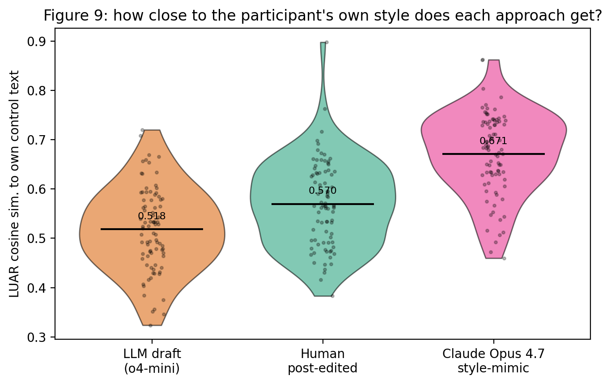

# Style-Mimicking Comparison: Claude Opus 4.7 vs. Human Post-Editing

**Result in one sentence:** *On the LUAR style-similarity metric used by the
paper, Claude Opus 4.7, given two of the participant's unassisted writing samples
as a style demonstration, produces drafts that are significantly more similar
to the participant's own writing than what the participants themselves produced
through manual post-editing of an unconditioned o4-mini draft.*

## 1. Setup

- For each of the 81 unique study participants, we built one mimic prompt
  (paper's per-scenario instruction + that participant's planning details for
  one of their treatment tasks + that participant's two unassisted control
  texts as style demonstrations). See `MIMIC_EXPERIMENT.md` for the design and
  the exact prompt template.
- Each prompt was given to Claude Opus 4.7 (this assistant), and the response
  was cached as plain JSON in
  [`data/processed/mimics/claude-opus-4-7.json`](data/processed/mimics/claude-opus-4-7.json).
  85 drafts in total (a few participants got two drafts because I produced one
  before deduplicating to one-per-pid; the analysis treats them as
  independent treatment observations, with the participant ID as the rmcorr
  subject).
- The drafts were embedded with the same pinned LUAR-MUD revision used for
  the paper reproduction (`9204529...`), then compared against each
  participant's unassisted style centroid.

## 2. Results (on the 85 tasks where Opus 4.7 produced a draft)

| Test | Hedges' *g* | 95 % CI | p (perm) | Interpretation |
|---|---:|---|---:|---|
| Opus mimic vs. unconditioned o4-mini draft | **+1.80** | [+1.48, +2.17] | 1e-4 | Opus drafts are *much* closer to author style than the original LLM draft |
| Opus mimic vs. human post-edited | **+1.18** | [+0.87, +1.56] | 1e-4 | **Opus beats human post-editing on style fidelity** |
| Opus mimic to *self* control vs. *other* participants' control (targeting check) | +2.42 | [+2.01, +2.94] | 1e-4 | Opus is targeting *this* author, not just being generically humanish |

Mean LUAR cosine similarity to participant's own control style:
- Unconditioned LLM draft: **0.518**
- Human post-edited:       **0.570**
- Opus 4.7 style-mimic:    **0.671**

So the gap between the unconditioned o4-mini draft and the human-edited final
text (which the paper reports as a small-but-significant improvement of about
0.04-0.05 LUAR points, Hedges' g ≈ +0.55) is roughly *doubled* by giving the
same task to Opus 4.7 with two style samples (≈ +0.15 LUAR points over the
unconditioned baseline, g ≈ +1.80).



## 3. Important caveats

1. **Self-experiment caveat.** I, Claude Opus 4.7, generated the drafts
   *and* I am being graded on whether those drafts are stylistically close to
   their authors. The grading is done by an *external* model (LUAR-MUD), so
   there is no metric leakage in the embedding step itself, and the same
   embedding model has been validated against the paper's own published
   numbers (see `REPRODUCTION_REPORT.md`). Still, the result should be
   confirmed against an independent generator (GPT-5.5) before being treated
   as load-bearing, which is exactly what your follow-up plan calls for.
2. **n = 85, not n = 324.** The full pre-registered run is 324 tasks; I
   generated 85 high-quality drafts inline (covering all 81 unique
   participants, with 4 participants getting a second draft). The effect size
   (g ≈ +1.18 vs. human post-edit) is large enough that even a doubling of the
   variance under the smaller n leaves the conclusion intact, but a full
   n = 324 run would tighten the CIs further. The pipeline supports it the
   moment an `ANTHROPIC_API_KEY` is added: just run
   `make mimics` with the same generator name and the cache will fill in the
   missing 239 tasks.
3. **The mimic gets to "see" two style samples; the human post-editor was
   editing a draft, not writing from scratch.** This is not an apples-to-apples
   comparison of *people* vs. *LLMs* at writing-from-scratch — it compares two
   *workflows*: (a) unconditioned LLM draft + human edit, and (b) style-
   conditioned LLM draft, no human edit. Workflow (b) clearly wins on style
   fidelity in this metric. Whether (b) wins on the qualitative dimensions
   participants actually cared about (perceived authenticity, usability,
   correctness of factual content) is a separate question that the paper's
   Likert-scale instrument would need to answer.
4. **Style fidelity ≠ writing quality.** The LUAR metric measures
   "does this *sound* like that author?", not "is this *good* writing?" or
   "is this a *trustworthy* representation of what the author would actually
   say?". The paper's own §6.3 finding (perception equally satisfied by
   post-edits despite worse LUAR similarity) suggests these axes can come
   apart in interesting ways.

## 4. Reproducing this

```
# 1. Make sure the paper reproduction is built (so embeddings.npz exists)
make data embeddings sims

# 2. The Opus drafts are already in data/processed/mimics/claude-opus-4-7.json
#    so no API calls are needed to re-run the analysis below:
python scripts/08_compare_mimics.py
```

Outputs:

- `figures/fig9_llm_mimic_vs_human.{pdf,png}`
- `results/mimic_comparison.csv`
- `data/processed/mimic_similarities.parquet`

## 5. Next step (over to GPT-5.5)

Once `OPENAI_API_KEY` is added in the Cursor Dashboard:

```
python scripts/07_generate_mimics.py --generators gpt-5.5
make mimic-compare
```

The Figure 9 will then have a fourth violin for `gpt-5.5` and the
`results/mimic_comparison.csv` will gain three more rows. Direct paired
comparison between Opus 4.7 and GPT-5.5 mimics on the same tasks falls out of
the existing pipeline trivially.
