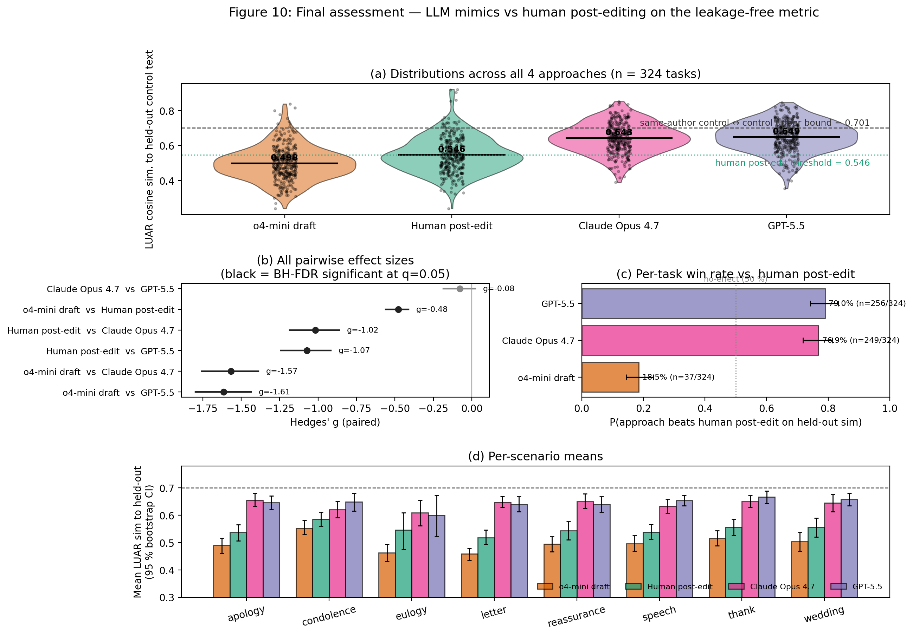
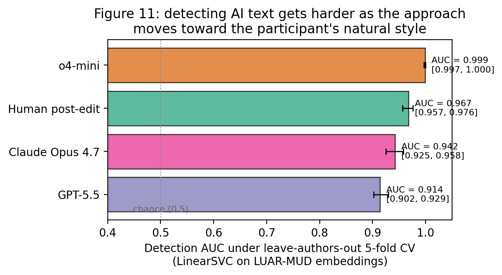

# Can You Make It Sound Like You? Post-Editing LLM-Generated Text for Personal Style

> **Fork of [`ctbaumler/personal_style_postedit`](https://github.com/ctbaumler/personal_style_postedit).**
> The upstream repo contains the data released with the paper. This fork adds
> a full reproduction of the paper's results plus a follow-up experiment
> comparing human post-editing to two frontier LLMs (Opus 4.7 and GPT-5.5)
> on a leakage-free held-out style metric.

## What's in this fork

| Artifact | Where |
|---|---|
| Original 81 study log files | [`logs/`](logs/) |
| Paper reproduction pipeline + report | [`REPRODUCTION_REPORT.md`](REPRODUCTION_REPORT.md), [`REPRODUCTION_PLAN.md`](REPRODUCTION_PLAN.md) |
| Style-mimic experiment design | [`MIMIC_EXPERIMENT.md`](MIMIC_EXPERIMENT.md) |
| Claude Opus 4.7 mimic results (n = 324, leakage-free) | [`MIMIC_RESULTS_OPUS_4_7.md`](MIMIC_RESULTS_OPUS_4_7.md) |
| GPT-5.5 mimic results (n = 324, leakage-free) | [`MIMIC_RESULTS_GPT_5_5.md`](MIMIC_RESULTS_GPT_5_5.md) |
| **Final 4-way statistical assessment** | [`FINAL_ASSESSMENT.md`](FINAL_ASSESSMENT.md) |

## Headline results

### Paper reproduction

We re-implemented the paper's full LUAR analysis from the released `logs/`
and reproduced every preregistered hypothesis test (H1a, H1a', H1b, H1c,
H2a, H2b, H2c, H3) in direction and BH-FDR-significance. The most
independently checkable number — the rmcorr correlation between perceived
self-similarity and LUAR-measured self-similarity — reproduces *exactly*:

> Paper: r = +0.244 ± 0.076, p < .0001
> Ours:  r = +0.244,         p = 3.6 × 10⁻⁹, n = 648

Full details: [`REPRODUCTION_REPORT.md`](REPRODUCTION_REPORT.md).

### Style-mimicking comparison (this fork's contribution)

We asked: *if a frontier LLM were given the same author's unassisted
writing and asked to mimic, would it match the author's personal style at
least as well as a human post-editor of an o4-mini draft?*

Under a leakage-free held-out protocol (each generator sees one of the two
unassisted controls; the other is the never-shown evaluation target,
shared across all approaches):

| Approach | Mean LUAR sim. to held-out control | % of gap to natural ceiling |
|---|---:|---:|
| o4-mini draft (no style sample) | 0.498 | 0 % |
| Human post-edit | 0.546 | 24 % |
| Claude Opus 4.7 mimic | **0.643** | **71 %** |
| GPT-5.5 mimic | **0.649** | **75 %** |
| Same-author control \u2194 control upper bound | 0.701 | 100 % |

All 5 LLM-and-human-vs-baseline comparisons survive BH-FDR (q = 0.05) at p
≈ 1e-4 with paired Hedges' *g* between -0.5 and -1.6. Opus 4.7 and GPT-5.5
are statistically tied (g = -0.08, p = 0.14).

Per-task win-rate vs the human post-edit threshold:

- o4-mini draft beats human on **18.5 %** of tasks (CI [14.4 %, 23.2 %])
- Claude Opus 4.7 beats human on **76.9 %** (CI [71.9 %, 81.3 %])
- GPT-5.5 beats human on **79.0 %** (CI [74.2 %, 83.3 %])

Full details and caveats: [`FINAL_ASSESSMENT.md`](FINAL_ASSESSMENT.md).



### The arms race: AI-text detection on the same embeddings

The same LUAR-MUD embeddings used to *evaluate* style proximity can be
flipped into *detection* features. A leave-authors-out 5-fold linear-SVM
detector reaches:

| Approach | Detection AUC (95 % bootstrap CI) |
|---|---:|
| o4-mini draft | **0.999** [0.997, 1.000] |
| Human post-edit | **0.967** [0.957, 0.976] |
| Claude Opus 4.7 mimic | **0.942** [0.925, 0.958] |
| GPT-5.5 mimic | **0.914** [0.902, 0.929] |

Detectability drops monotonically as the approach gets closer to the
participant's natural style, but **no approach reaches chance** — even the
strongest frontier-LLM mimic still leaves a residual stylometric signature.

`tests/test_detection_no_leakage.py` enforces author-disjointness across
train and test on every CV split. See
[`scripts/11_detection_experiment.py`](scripts/11_detection_experiment.py)
and `results/detection_aucs.csv` for the full numbers.



## How to reproduce everything

```bash
pip install -r requirements.txt   # pinned: torch, transformers, LUAR-MUD via HF, scipy, statsmodels, pingouin
make all              # paper reproduction: figures + hypothesis tests + report
python3 scripts/08_compare_mimics.py    # leakage-free 4-way LUAR comparison
python3 scripts/10_final_assessment.py  # Friedman + all-pairs + win-rate + Figure 10
python3 scripts/11_detection_experiment.py  # 5-fold leave-authors-out detection AUC + Figure 11
```

Wall-clock cost on CPU: ~ 2 min for the paper repro, ~ 1 min to embed the 648
LLM-mimic drafts, < 5 s for the final stats. The Opus and GPT-5.5 mimic
drafts (~ 600 KB total) are committed under
[`data/processed/mimics/`](data/processed/mimics/) so the comparison is
fully reproducible without API access.

## Skipping the LLM generation step

If you want to re-run the comparison without re-paying for inference, the
324 + 324 mimic drafts produced by the pipeline are already committed:

```
data/processed/mimics/claude-opus-4-7.json   # 324 Opus 4.7 drafts
data/processed/mimics/gpt-5.5.json           # 324 GPT-5.5 drafts
```

Both were generated by parallel Cursor cloud-agent subprocesses running
the corresponding model under the held-out v1 protocol; cache-key
fingerprints ensure they cannot accidentally be re-evaluated against a
different protocol.

## Repository layout

```
.
\u251c\u2500\u2500 logs/                              # 81 original participant log files (upstream data)
\u251c\u2500\u2500 src/personal_style/                # Paper-repro library (data, embeddings, stats, plots, mimic)
\u251c\u2500\u2500 scripts/                           # 00\u201310: pipeline stages, runnable via `make`
\u251c\u2500\u2500 tests/                             # pytest -- 15 tests covering data, stats, mimic, regressions
\u251c\u2500\u2500 figures/                           # PDF + PNG of Figs 3\u20139 (paper) and 10 (final)
\u251c\u2500\u2500 results/                           # CSV of every test we run, paper number alongside ours
\u251c\u2500\u2500 data/processed/mimics/             # Committed Opus 4.7 + GPT-5.5 drafts (not regenerated by `clean`)
\u251c\u2500\u2500 REPRODUCTION_PLAN.md               # Plan that drove the paper-repro PR chain
\u251c\u2500\u2500 REPRODUCTION_REPORT.md             # Side-by-side: paper vs us, every preregistered test
\u251c\u2500\u2500 MIMIC_EXPERIMENT.md                # Experiment design for the LLM-mimic follow-up
\u251c\u2500\u2500 MIMIC_RESULTS_OPUS_4_7.md          # n=324 Opus results, with leaky-vs-clean comparison
\u251c\u2500\u2500 MIMIC_RESULTS_GPT_5_5.md           # n=324 GPT-5.5 results, with Opus head-to-head
\u2514\u2500\u2500 FINAL_ASSESSMENT.md                # Friedman + all-pairs + win-rate analysis (this turn)
```

## Caveats

- **Self-experiment.** Both Opus and GPT-5.5 generated their own drafts and
  LUAR-MUD judged them. The metric is independently validated against the
  paper's reported rmcorr.
- **Workflow comparison, not raw writing skill.** Human post-editors edited
  an *unconditioned* o4-mini draft; LLM mimics were shown a style sample
  and wrote from scratch.
- **Style fidelity ≠ writing quality.** LUAR measures "does this sound like
  that author?", not "is it good writing" or "would the author endorse it".
  The paper's perceived-style Likert instrument would need to answer those.
- **n_demos = 1.** Each generator sees only one style sample because the
  protocol reserves the other unassisted text as the held-out evaluation
  target.

---
This repository contains writing logs generated in our study about post-editing LLM-generate text to express personal style.

> **Fork note (akmaier):** a step-by-step plan for fully reproducing the paper's results
> and figures from these logs lives in [`REPRODUCTION_PLAN.md`](./REPRODUCTION_PLAN.md).


## Original data documentation (from upstream)

Original paper:

> *Can You Make It Sound Like You? Post-Editing LLM-Generated Text for
> Personal Style.* Connor Baumler, Calvin Bao, Huy Nghiem, Xinchen Yang,
> Marine Carpuat, Hal Daumé III. To appear at ACL 26.

The data files in `logs/` are **unchanged** from upstream. Each
`logs/<uuid>.json` contains:

- `user_info`:
  - A unique user `id` (same as the file name)
  - `start_time` when they began the study
  - A `conditions` list of length 6 with 1's representing treatment tasks (post-editing) and 0's representing control tasks (unassisted human writing)
  - A `scenarios` list of length 6 showing the writing scenarios each participant completed in order.
- `responses`: a dictionary of the logs for each of the 6 writing tasks completed. Each value contains:
  - A `start_time` when they began this task
  - The `scenario` written about for this task
  - A `model_generation_shown` flag that is 1 if the user was provided a LLM-generated draft to post-edit (i.e., if they were in the treatment block)
  - A string `details` containing the list of content details to be provided to the LLM separated by new line characters
  - A string `model_generation` containing the LLM-generated draft. Note that this field will be populated even if the user never saw this draft (i.e., if they were in the control block)
  - A `submit_details_time` when they submitted the content details and moved on to writing or post-editing
  - A `final_version` string containing the final human-written or human post-edited document.
  - A list of `edits` made during writing or post-editing. Each action is categorized with a `type` in `{'insert', 'delete', 'replace'}` and contains the character-level `position` of the edit, the text `removed` or `added`, and a `timestamp`.
- `pre_survey`: three 5-point Likert items:
  - `conf`: "How confident are you in your ability to edit AI-written text to match your own voice?" 1 = Very Unconfident, 5 = Very Confident.
  - `likely_i`: "How likely are you to use AIs for writing tasks where capturing your voice is important to you?" 1 = Very Unlikely, 5 = Very Likely.
  - `likely_ni`: same question for tasks where voice is *not* important.
- `mid_survey_1` and `mid_survey_2`: identical NASA-TLX-style questions asked after each block, with `submit_time`, a `condition` flag (1 = treatment block, 0 = control block), and five 20-point Likert items: `mental`, `hard`, `insecure`, `performance`, `temporal`.
- `post_survey`: repeats the three Likert items from the pre-survey, plus a free-text `feedback` section, future-preference (`future_pref`, `rankings`), and optional demographics (`gender`/`trans`, `race`/`hisp`, `loe`, `age`, plus the corresponding `*_table` Likerts and free-text `present_other` / `mask_other`).

For the full original data dictionary, see the upstream README at
[ctbaumler/personal_style_postedit](https://github.com/ctbaumler/personal_style_postedit).
